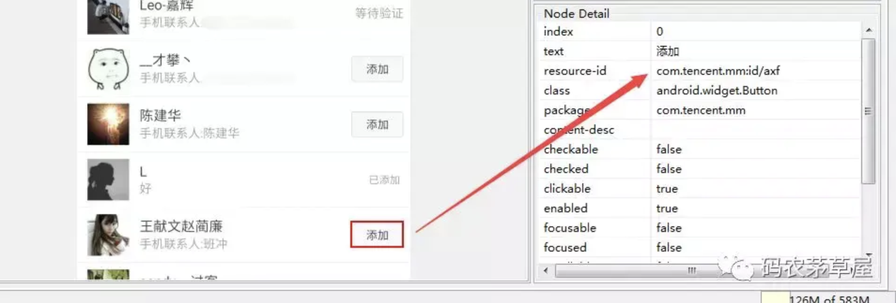
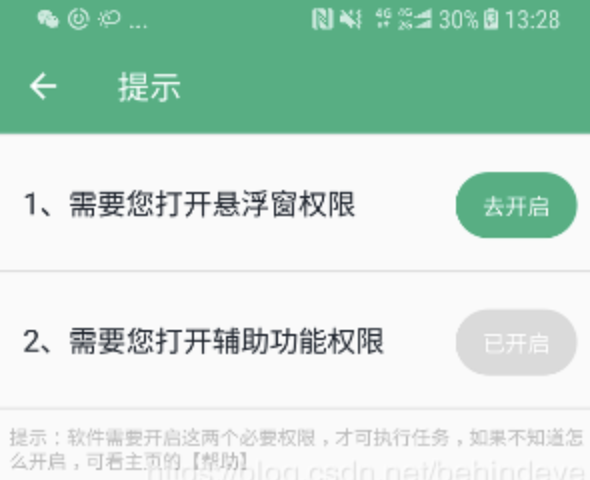
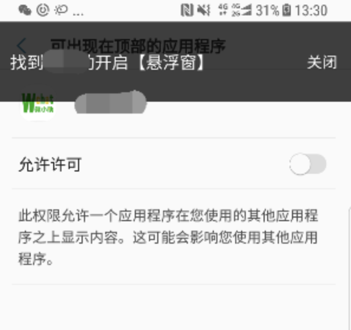
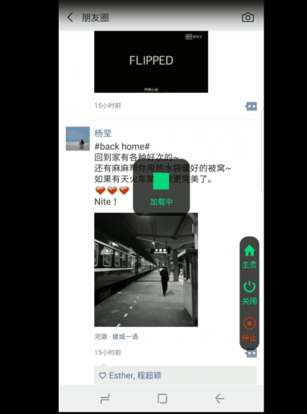
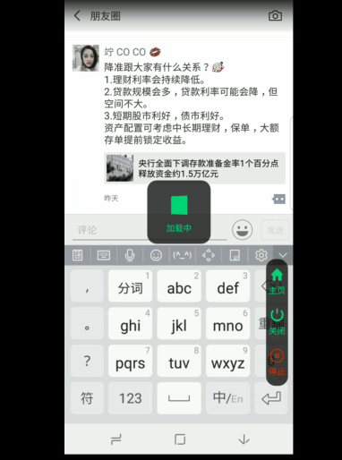

# Android 悬浮窗

## Android 悬浮窗踩坑体验

> 大家都知道，悬浮窗的问题，一直都是众开发者比较恶心的问题，加上 google 在7.0之后，更是对悬浮窗加大了管理，原本设置悬浮窗类型为 TYPE_TOAST 还能显示，现在是直接关闭掉了；不过值得提一下的是，TYPE_TOAST 类型的悬浮窗，在国内的一些机型，也不能显示，这要怎么处理呢？

## 1、判断是否开启了悬浮窗的权限

1、如果用户开启了悬浮窗的权限，那就好办啦，直接使用我们悬浮窗。判断方法：

```java
/**
 * 判断悬浮窗口权限是否打开
 */
public static boolean hasFloatWindowAccessPermission(Context context) {
    if (Build.VERSION.SDK_INT >= 23) {
        return Settings.canDrawOverlays(context);
    }
    try {
        Object object = context.getSystemService(Context.APP_OPS_SERVICE);
        if (object == null) {
            return false;
        }
        Class localClass = object.getClass();
        Class[] arrayOfClass = new Class[3];
        arrayOfClass[0] = Integer.TYPE;
        arrayOfClass[1] = Integer.TYPE;
        arrayOfClass[2] = String.class;
        Method method = localClass.getMethod("checkOp", arrayOfClass);
        if (method == null) {
            return false;
        }
        Object[] arrayOfObject1 = new Object[3];
        arrayOfObject1[0] = Integer.valueOf(24);
        arrayOfObject1[1] = Integer.valueOf(Binder.getCallingUid());
        arrayOfObject1[2] = context.getPackageName();
        int m = ((Integer) method.invoke(object, arrayOfObject1)).intValue();
        return m == AppOpsManager.MODE_ALLOWED;
    } catch (Exception e) {
        e.printStackTrace();
    }
    return false;
}
```

## 2、使用悬浮窗类型为 TYPE_TOAST 的窗口

1、部分手机，在没有开启悬浮窗的权限的时候，可以使用 TYPE_TOAST 类型，弹出悬浮窗。例如：

```java
    mTaskProgressParams.type = WindowManager.LayoutParams.TYPE_TOAST;
```

## 3、利用反射，自定义Toast来弹出悬浮窗

1、我们都知道，吐司的显示，也是悬浮窗的级别的，但是不需要悬浮窗的权限，那我们就在Toast基础上，通过反射来，设置悬浮窗。这种对于设置 TYPE_TOAST 类型，也不生效的手机，可以适用。
public class MyToast {

```java
private Toast mToast;
private Context mContext;
private boolean isShow = false;

private TaskView mView;
private Object mTN;
private Method show;
private Method hide;
private WindowManager.LayoutParams mLayoutParams;


public MyToast(Context context) {
    this.mContext = context;
    if (mToast == null) {
        mToast = new Toast(mContext);
    }
    mView = new TaskView(mContext);
    mToast.setView(mView);
}

public void setNextOnClickListener(View.OnClickListener l) {
    mView.setNextOnClickListener(l);
}

public void setTimeCountDown(int times) {
    mView.setTimeCountDown(times);
}

public void show() {
    if (isShow)
        return;
    initTN();
    try {
        if (Build.VERSION.SDK_INT <= 23) {
            show.invoke(mTN);
        } else {
            show.invoke(mTN, mView.getWindowToken());
        }
    } catch (Exception e) {
        e.printStackTrace();
    }
    isShow = true;
    Log.i("czc", "SettingSlideLockToast is showing");
}

public void hide() {
    if (!isShow)
        return;
    try {
        hide.invoke(mTN);
    } catch (Exception e) {
        e.printStackTrace();
    }
    isShow = false;
    mView.stopTimeCountDown();
    Log.i("czc", "SettingSlideLockToast is hided");
}

private void initTN() {
    try {
        Field tnField = mToast.getClass().getDeclaredField("mTN");
        tnField.setAccessible(true);
        mTN = tnField.get(mToast);

        Field tnParamsField = mTN.getClass().getDeclaredField("mParams");
        tnParamsField.setAccessible(true);
        mLayoutParams = (WindowManager.LayoutParams) tnParamsField.get(mTN);
        mLayoutParams.format = PixelFormat.TRANSLUCENT;
        //this flag set view don't interrupt touch event
        mLayoutParams.flags = WindowManager.LayoutParams.FLAG_LAYOUT_IN_SCREEN
                | WindowManager.LayoutParams.FLAG_LAYOUT_NO_LIMITS
                | WindowManager.LayoutParams.FLAG_NOT_FOCUSABLE
                | FLAG_NOT_TOUCH_MODAL;
        mLayoutParams.softInputMode = WindowManager.LayoutParams.SOFT_INPUT_ADJUST_NOTHING;
        mLayoutParams.screenOrientation = ActivityInfo.SCREEN_ORIENTATION_PORTRAIT;
        mLayoutParams.windowAnimations = R.style.SettingClickToastAnim;
        mLayoutParams.width = ScreenUtil.getRawScreenWidth();
        mLayoutParams.height = ScreenUtil.dp2px(70);
        mLayoutParams.x = 0;
        mLayoutParams.y = 0;


        /**调用tn.show()之前一定要先设置mNextView*/
        Field tnNextViewField = mTN.getClass().getDeclaredField("mNextView");
        tnNextViewField.setAccessible(true);
        tnNextViewField.set(mTN, mToast.getView());

        if (Build.VERSION.SDK_INT <= 23) {
            show = mTN.getClass().getMethod("show");
        } else {
            show = mTN.getClass().getMethod("show", new Class[]{IBinder.class});
            mLayoutParams.type = WindowManager.LayoutParams.TYPE_PHONE;
        }
        hide = mTN.getClass().getMethod("hide");
    } catch (Exception e) {
        e.printStackTrace();
    }
    mToast.setGravity(Gravity.LEFT | Gravity.TOP, 0, 0);
}}
```


# Android 辅助权限与悬浮窗


# 第一节

> 本文旨在介绍AccessibilityService如果更优雅的使用，以及使用过程遇到的问题，该怎么解决。

## 一、介绍

辅助功能服务在后台运行，并在触发AccessibilityEvent时由系统接收回调。这样的事件表示用户界面中的一些状态转换，例如，焦点已经改变，按钮被点击等等。现在常用于自动化业务中，例如：*微信自动抢红包插件，微商自动加附近好友，自动评论朋友，点赞朋友圈，甚至运用在群控系统，进行刷单*。

## 二、配置

1、新建Service并继承AccessibilityService

```java
    /**
     * 核心服务：执行自动化任务
     * Created by czc on 2017/6/13.
     */
    public class TaskService_ extends AccessibilityService{
        @Override
        public void onAccessibilityEvent(AccessibilityEvent event) {
            //注意这个方法回调，是在主线程，不要在这里执行耗时操作
        }
        @Override
        public void onInterrupt() {
    
        }
    }
```

2、并配置AndroidManifest.xml

```xml
    <service
        android:name=".service.TaskService"
        android:enabled="true"
        android:exported="true"
        android:label="@string/app_name_setting"
        android:permission="android.permission.BIND_ACCESSIBILITY_SERVICE">
        <intent-filter>
            <action android:name="android.accessibilityservice.AccessibilityService"/>
        </intent-filter>

        <meta-data
            android:name="android.accessibilityservice"
            android:resource="@xml/accessibility"/>
    </service>
```

3、在res目录下新建xml文件夹，并新建配置文件accessibility.xml

```xml
<?xml version="1.0" encoding="utf-8"?>
<accessibility-service xmlns:android="http://schemas.android.com/apk/res/android"
    <!--监视的动作-->
    android:accessibilityEventTypes="typeAllMask"
    <!--提供反馈类型，语音震动等等。-->
    android:accessibilityFeedbackType="feedbackGeneric"
     <!--监视的view的状态，注意这里设置flagDefault会到时候部分界面状态改变，不触发onAccessibilityEvent(AccessibilityEvent event)的回调-->
    android:accessibilityFlags="flagDefault|flagRetrieveInteractiveWindows|flagIncludeNotImportantViews|flagReportViewIds|flagRequestTouchExplorationMode"
    <!--是否要能够检索活动窗口的内容，此设置不能在运行时改变-->
    android:canRetrieveWindowContent="true"
    <!--功能描述-->
    android:description="@string/description"
    <!--同一事件间隔时间名-->
    android:notificationTimeout="100" 
    <!--监控的软件包名-->
    android:packageNames="com.tencent.mm,com.eg.android.AlipayGphone" />
```

## 三、核心方法

1、根据界面text找到对应的组件（注：方法返回的是集合，找到的组件不一点唯一，同时这里的text不单单是我们理解的 TextView 的 Text，还包括一些组件的 ContentDescription）

```java
accessibilityNodeInfo.findAccessibilityNodeInfosByText(text)
```

2、根据组件 id 找到对应的组件（注：方法返回的是集合，找到的组件不一点唯一，组件的 id 获取可以通过 Android Studio 内置的工具 monitor 获取，该工具路径：C:\Users\Dell\AppData\Local\Android\Sdk\tools）

```java
accessibilityNodeInfo.findAccessibilityNodeInfosByViewId(id)
```



## 四、辅助权限判断是否开启

```java
    public static boolean hasServicePermission(Context ct, Class serviceClass) {
        int ok = 0;
        try {
            ok = Settings.Secure.getInt(ct.getContentResolver(), Settings.Secure.ACCESSIBILITY_ENABLED);
        } catch (Settings.SettingNotFoundException e) {
        }

        TextUtils.SimpleStringSplitter ms = new TextUtils.SimpleStringSplitter(':');
        if (ok == 1) {
            String settingValue = Settings.Secure.getString(ct.getContentResolver(), Settings.Secure.ENABLED_ACCESSIBILITY_SERVICES);
            if (settingValue != null) {
                ms.setString(settingValue);
                while (ms.hasNext()) {
                    String accessibilityService = ms.next();
                    if (accessibilityService.contains(serviceClass.getSimpleName())) {
                        return true;
                    }
                }
            }
        }
        return false;
    }
```

## 五、辅助的开启方法

1.root 授权环境下，无需引导用户到系统设置页面开启

```java
    public static void openServicePermissonRoot(Context ct, Class service) {
        String cmd1 = "settings put secure enabled_accessibility_services  " + ct.getPackageName() + "/" + service.getName();
        String cmd2 = "settings put secure accessibility_enabled 1";
        String[] cmds = new String[]{cmd1, cmd2};
        ShellUtils.execCmd(cmds, true);
    }
```

2.targetSdk 版本小于23的情况下，部分手机也可通过以下代码开启权限，为了兼容，最好 try...catch 以下异常

```java
    public static void openServicePermission(Context ct, Class serviceClass) {
        Set<ComponentName> enabledServices = getEnabledServicesFromSettings(ct, serviceClass);
        if (null == enabledServices) {
            return;
        }
        ComponentName toggledService = ComponentName.unflattenFromString(ct.getPackageName() + "/" + serviceClass.getName());
        final boolean accessibilityEnabled = true;
        enabledServices.add(toggledService);
        // Update the enabled services setting.
        StringBuilder enabledServicesBuilder = new StringBuilder();
        for (ComponentName enabledService : enabledServices) {
            enabledServicesBuilder.append(enabledService.flattenToString());
            enabledServicesBuilder.append(":");
        }
        final int enabledServicesBuilderLength = enabledServicesBuilder.length();
        if (enabledServicesBuilderLength > 0) {
            enabledServicesBuilder.deleteCharAt(enabledServicesBuilderLength - 1);
        }
        Settings.Secure.putString(ct.getContentResolver(), Settings.Secure.ENABLED_ACCESSIBILITY_SERVICES, enabledServicesBuilder.toString());
        // Update accessibility enabled.
        Settings.Secure.putInt(ct.getContentResolver(), Settings.Secure.ACCESSIBILITY_ENABLED, accessibilityEnabled ? 1 : 0);
    }

    public static Set<ComponentName> getEnabledServicesFromSettings(Context context, Class serviceClass) {
        String enabledServicesSetting = Settings.Secure.getString(context.getContentResolver(), Settings.Secure.ENABLED_ACCESSIBILITY_SERVICES);
        if (enabledServicesSetting == null) {
            enabledServicesSetting = "";
        }
        Set<ComponentName> enabledServices = new HashSet<ComponentName>();
        TextUtils.SimpleStringSplitter colonSplitter = new TextUtils.SimpleStringSplitter(':');
        colonSplitter.setString(enabledServicesSetting);
        while (colonSplitter.hasNext()) {
            String componentNameString = colonSplitter.next();
            ComponentName enabledService = ComponentName.unflattenFromString(componentNameString);
            if (enabledService != null) {
                if (enabledService.flattenToString().contains(serviceClass.getSimpleName())) {
                    return null;
                }
                enabledServices.add(enabledService);
            }
        }
        return enabledServices;
    }
```

3.引导用户到系统设置界面开启权限

```java
    public static void jumpSystemSetting(Context ct) {
        // jump to setting permission
        Intent intent = new Intent(Settings.ACTION_ACCESSIBILITY_SETTINGS);
        intent.addFlags(Intent.FLAG_ACTIVITY_NEW_TASK);
        ct.startActivity(intent);
    }
```

4.结合一起，我们可以这样开启辅助权限

```java
    public static void openServicePermissonCompat(final Context ct, final Class service) {
        //辅助权限：如果root，先申请root权限
        if (isAppRoot()) {
            if (!hasServicePermission(ct, service)) {
                new Thread(new Runnable() {
                    @Override
                    public void run() {
                        openServicePermissonRoot(ct, service);
                    }
                }).start();
            }
        } else {
            try {
                openServicePermission(ct, service);
            } catch (Exception e) {
                e.printStackTrace();
                if (!hasServicePermission(ct, service)) {
                    jumpSystemSetting(ct);
                }
            }
        }
    }
```

# 第二节

> 在执行自动化服务的流程中，我们其实并不希望被用户的操作中断流程，所以有什么方法在用户点击自动化操作的过程中，避免用户再次操作呢？那就是开启一个全局透明的悬浮窗，进行屏蔽触摸事件。

## 一、悬浮窗

其实一开始，我是想当然的跟以前一样，开启一个全屏的透明的悬浮窗，进行遮罩的作用，但是发现，设置 Type 为 **TYPE_TOAST** 或者  **TYPE_SYSTEM_ALERT** 这样的悬浮窗某些类型的不同，会导致不单单把用户的操作屏蔽了，甚至窗口的一些状态改变也屏蔽的，导致辅助权限的 onAccessibilityEvent() 方法不回调，于是去找官方文档，查找相关悬浮窗的 Type 类型设置。然后被我找到这个属性值的 Type ：

```java
LayoutParams.TYPE_ACCESSIBILITY_OVERLAY
```

我们再来看官方解释：

> Windows that are overlaid only by a connected AccessibilityService for interception of user interactions without changing the windows an accessibility service can introspect. In particular, an accessibility service can introspect only windows that a sighted user can interact with which is they can touch these windows or can type into these windows. For example, if there is a full screen accessibility overlay that is touchable, the windows below it will be introspectable by an accessibility service even though they are covered by a touchable window.

虽然官方写的一大堆，但是我们大概能 get 到里面的意思，其实就是设置为这个类型的悬浮窗，能够使辅助功能继续响应相关窗口与内容的变化。经测试，果然设置这个类型的悬浮窗，可以一方面屏蔽用户的触摸事件，另一方继续响应自动点击的相关操作。

```java
    public void createFullScreenView(Context context) {
        WindowManager windowManager = getWindowManager(context);
        if (fullScreenView == null) {
            fullScreenView = new FloatWindowFullScreenView(context);
            LayoutParams fullScreenParams = new LayoutParams();
            if (Build.VERSION.SDK_INT >= Build.VERSION_CODES.LOLLIPOP_MR1) {
                fullScreenParams.type = LayoutParams.TYPE_ACCESSIBILITY_OVERLAY;
            } else {
                fullScreenParams.type = LayoutParams.TYPE_TOAST;
            }
            fullScreenParams.format = PixelFormat.TRANSLUCENT;
            fullScreenParams.flags |= WindowManager.LayoutParams.FLAG_FULLSCREEN
                    | WindowManager.LayoutParams.FLAG_NOT_FOCUSABLE
                    | LayoutParams.FLAG_KEEP_SCREEN_ON
                    | WindowManager.LayoutParams.FLAG_NOT_TOUCH_MODAL;
            fullScreenParams.gravity = Gravity.CENTER;
            windowManager.addView(fullScreenView, fullScreenParams);
        }
    }
```

值得注意的是，这个属性是在 android 5.1 之后加入进来，对于之前的版本，经测试，使用 Toast 类型，也能执行相关操作，至于为什么 5.1 之后不继续使用Toast类型呢，这里面涉及到悬浮窗的开启问题了，可自行百度悬浮窗的开启相关文章。

## 二、悬浮窗的 Context

我们一般开启悬浮窗的过程中，Context 的传递我们使用的 Service 或者 Activity，不过如果设置为 **TYPE_ACCESSIBILITY_OVERLAY 的悬浮窗，是只能传入你继承自 AccessibilityService 的服务（Context，否则会报 Is Activity Running 这个异常**，那如何在这个服务里面开启悬浮窗呢？我是使用广播的形式去开启的：

```java
    // 注册广播接听者
    IntentFilter filter = new IntentFilter();
    filter.addAction(Const.ACTION_SHOW_COVER_VIEW);
    filter.addAction(Const.ACTION_SHOW_SMALL_VIEW);
    filter.addAction(Const.ACTION_SET_COVER_VIEW_TIPS);
    registerReceiver(mReceiver, filter);
        
    ....省略其他代码
    
    private BroadcastReceiver mReceiver = new BroadcastReceiver() {
        @Override
        public void onReceive(Context context, Intent intent) {
            String action = intent.getAction();
            if (action.equals(Const.ACTION_SHOW_COVER_VIEW)) {
                if (!FloatWindowManager.getInstance().isFullWindowShowing()) {
                    FloatWindowManager.getInstance().createFullScreenView(TaskService.this);
                }
                String toast = intent.getStringExtra(Const.EXTRA_WINDOW_TOAST);
                if (!StringUtils.isEmpty(toast)) {
                    FloatWindowManager.getInstance().showToast(toast);
                }
            } else if (action.equals(Const.ACTION_SHOW_SMALL_VIEW)) {
                if (!FloatWindowManager.getInstance().isSmallWindowShowing()) {
                    FloatWindowManager.getInstance().createSmallWindow(TaskService.this);
                }
            }else if (action.equals(Const.ACTION_SET_COVER_VIEW_TIPS)) {
                if (FloatWindowManager.getInstance().isFullWindowShowing()) {
                    FloatWindowManager.getInstance().showTipst(intent.getStringExtra("tips"));
                }
            }
        }
    };
```

## 三、悬浮窗开启引导

为了更好的用户体验，我们需要给我们每一步操作一个明确的提示，让用户知道需要做些什么，特别是引导开启系统权限的时候。

关于悬浮窗的开启，之前有写过一篇文章，[Android 悬浮窗踩坑体验](https://blog.csdn.net/behindeye/article/details/78221294)，里面有介绍关于悬浮窗的开启、权限以及自定义悬浮窗。不过这里我要介绍的是另一种特殊的技巧，在没有开启悬浮窗权限的情况下，用一个特殊的 Activity 来代替悬浮窗。先介绍两个 Activity 在 AndroidManifest 属性：

#### 1、taskAffinity

简单讲一下这个属性的意思：默认情况下，我们启动的 Activity 都是归属于同包名的任务栈里面，但如果配置这个属性，则该 Activity 会在新的任务栈里面（栈名是你配置的）

```xml
android:taskAffinity=".guide"
```

可以通过以下命令去查看当前任务栈的信息：

```shell
adb shell dumpsys activity activities
```

#### 2、excludeFromRecents

当配置这个属性，可以让你的 Activity 不会出现在最近任务列表里面

```xml
android:excludeFromRecents="true"
```

#### 3、配置 Activity 主题是全屏透明

```xml
android:theme="@android:style/Theme.Translucent.NoTitleBar.Fullscreen"
```

**为什么要配置这两个属性呢？** 因为我们不希望这个特殊的Activity出现在**最近的使用列表里面**，同时配置 taskAffinity 是为了让这个 Activity 在新的任务栈里面，使得它在 finish 的时候，不是回到我们之前启动过的前一个 Activity （并不想影响我们之前的任务栈），这样的做法就能够在其他 App 界面显示我们的 Activity，**需要特别说明的的是：启动该 Acitivity 需要配合    Intent.FLAG_ACTIVITY_NEW_TASK 标识启动**。代码如下：

```xml
<activity
    android:name="com.czc.ui.act.GuideActivity"
    android:taskAffinity=".guide"
    android:excludeFromRecents="true"
    android:theme="@android:style/Theme.Translucent.NoTitleBar.Fullscreen">
</activity>
```

完整代码：

```xml
public class GuideActivity extends Activity {

    public static void start(Activity act, String message) {
        Intent intent = new Intent(act, GuideActivity.class);
        intent.putExtra("message", message);
        intent.addFlags(Intent.FLAG_ACTIVITY_NEW_TASK);
        intent.addFlags(Intent.FLAG_ACTIVITY_EXCLUDE_FROM_RECENTS);
        act.startActivity(intent);
    }

    @Override
    protected void onCreate(Bundle savedInstanceState) {
        super.onCreate(savedInstanceState);
        setContentView(R.layout.activity_guide);

        //设置Activity界面大小
        Window window = getWindow();
        window.setGravity(Gravity.LEFT | Gravity.TOP);
        WindowManager.LayoutParams params = window.getAttributes();
        params.x = 0;
        params.y = 0;
        params.flags = WindowManager.LayoutParams.FLAG_NOT_TOUCH_MODAL
                | WindowManager.LayoutParams.FLAG_NOT_FOCUSABLE;
        params.height = ScreenUtil.dip2px(80);
        params.width = WindowManager.LayoutParams.MATCH_PARENT;
        window.setAttributes(params);

        TextView tvMessage = findViewById(R.id.tv_message);
        tvMessage.setText(getIntent().getStringExtra("message"));

        new Handler().postDelayed(new Runnable() {
            @Override
            public void run() {
            // 5s 后自动关闭提示
                finish();
            }
        }, 5000);
    }
}
```

#### 4、界面呈现的效果

1.检测到没有【悬浮窗权限】或者【辅助权限】，弹出权限设置页面 PermissionActivity



2.跳转系统设置里面的同时【弹出】 GuideActivity



## 四、悬浮窗的实现

在悬浮窗的UI设计上，我们需要将其设置为透明背景，这样对用户是无感的，整个自动化流程中，其实是相当于屏幕有个用户看不到的“保护罩”在确保着你的自动化业务不被“打扰”。在布局上，我们需要实现最外层的根布局的点击事件，这样在用户点击屏幕的时候，弹窗 Toast 友好提示用户：自动化业务正在执行，请停止业务才能操作。

同时悬浮窗提供“停止”按钮，可以终止业务并关闭全屏透明悬浮窗。

## 五、使用场景

部分软件需要开启许多权限才能保证软件的正常使用，例如市面上的某锁屏软件，他们需要涉及相当多的权限，如果一个个让用户去开启，可能找不到对应的权限怎么开启，于是他们把这个流程简化成脚本，只要用户开启辅助权限，则跳转到权限开启流程，自动到权限页面，把例如：开机自启动权限，读取通知，获取位置等权限开启。当然这个过程是被一个界面遮盖了的，用户是看不到执行了什么操作的（这也暴露android的安全性问题）。


# Android辅助权限之微信自动评论与点赞

> 当我们把辅助权限玩的比较熟悉 的时候，就可以释放我们的双手做一些有趣的事情了，例如之前网上流传的**微信自动抢红包插件**，就是使用的这个服务，不过我们今儿讲的是**微信自动评论与点赞**功能（抢红包的文章网上已经有比较多）。

## 一、悬浮窗配置

关于悬浮窗的详细配置，请看我另一篇博文，这里不再赘述，「传送门」：

[Android 辅助权限与悬浮窗](https://juejin.im/post/6844903764604747784)

## 二、自动化逻辑代码实现

> 说明：我们通过 Monitor 工具，取到的节点 id ，在微信的每个版本是不一样的 **(微信动态生成节点 id，我是通过服务器后台对不同的微信版本，维护一份 id 配置，根据请求的微信版本，返回对应得 id 值）**，所以本文以微信 v6.7.2 的版本作为例子，如下代码可作参考。

这里只是提供了微信自动点赞与自动评论的示例，**当然本人也写了类似于微信自动加好友，自动加附近的人，检测死粉的功能，钉钉自动打卡...** 这里只是抛转引玉，大家根据我提供的思路，去实现，由于源码涉及服务器相关操作，不太方便开源，

```java
{
    "tasks": [
        {
            "nodes": [
                {
                    "action": "scrllor", 
                    "className": "android.widget.ListView", 
                    "id": "com.tencent.mm:id/cno", 
                    "key": "nearHumanList", 
                    "text": "@附近的人列表"
                }, 
                {
                    "className": "android.widget.TextView", 
                    "id": "com.tencent.mm:id/b3i", 
                    "key": "nearHumanListName", 
                    "text": "@附近的人列表名字"
                }, 
                {
                    "className": "android.widget.TextView", 
                    "id": "com.tencent.mm:id/sm", 
                    "key": "detailName", 
                    "text": "@附近的人详情名字"
                }, 
                {
                    "className": "android.widget.ListView", 
                    "id": "com.tencent.mm:id/bcs", 
                    "key": "phoneHumanList", 
                    "text": "@手机联系人列表"
                }, 
                {
                    "className": "android.widget.TextView", 
                    "id": "com.tencent.mm:id/bgl", 
                    "key": "phoneHumanListName", 
                    "text": "@手机联系人列表名字"
                }, 
                {
                    "className": "android.widget.TextView", 
                    "id": "com.tencent.mm:id/bgm", 
                    "key": "phoneHumanListAccount", 
                    "text": "@手机联系人列表昵称"
                }, 
                {
                    "className": "android.widget.TextView", 
                    "id": "com.tencent.mm:id/sm", 
                    "key": "phoneHumandetailName", 
                    "text": "@手机联系人详情名字"
                }, 
                {
                    "className": "android.widget.ListView",
                    "id": "com.tencent.mm:id/doq",
                    "key": "momentList",
                    "text": "@朋友圈列表"
                }
            ],
            "pages": [ ],
            "taskName": "微信脚本",
            "version": "6.7.2"
        }
    ]
}
```

#### 1、微信朋友圈自动点赞

效果如图（希望我朋友不会打我，这里就不视频打码了，┭┮﹏┭┮），这里面的悬浮窗可以有效阻挡用户操作，只有点击停止之后，才能操作微信界面。



```java
/**
 * 朋友圈点赞
 * Created by czc on 2018/8/23.
 */
public class LikeStrategy extends BaseStrategy {

    @Override
    protected boolean handleEvent() {
        /**
         * 匹配每个界面，根据当前界面执行相关操作
         * 1、在微信首页点击【发现】按钮
         * 2、然后点击【朋友圈】，进入朋友圈界面
         * 3、滚动朋友圈【动态列表】，对每个动态进行点赞
         */
        if (matchPage(Page.LauncherUI) || matchPage(Page.WxViewPager)) {
            clickFindBtn(getRoot());
            clickCommentTv(getRoot());
        } else if (checkWxScroller(Page.SnsTimeLineUI)) {
            scrollerList(getRoot());
        } else if (matchPage(Page.BaseP)) {

        } else {
            return false;
        }
        return true;
    }


    private void clickFindBtn(AccessibilityNodeInfo root) {
        NodeUtil.findNodeByTextAndClick(root, "发现");
    }

    private void clickCommentTv(AccessibilityNodeInfo root) {
        NodeUtil.findNodeByTextAndClick(root, "朋友圈");
    }


    private void scrollerList(AccessibilityNodeInfo root) {
        //这里的滚动控件对应于朋友圈动态的 ListView 
        AccessibilityNodeInfo scrollerNode = findNodeByTaskNode(root, getNode("momentList"));
        if (scrollerNode == null) {
            Log.e(TAG, "scroller is null");
            return;
        }
        if (scrollerNode != null) {
            final int count = scrollerNode.getChildCount();
            for (int i = 0; i < count; i++) {
                AccessibilityNodeInfo child = scrollerNode.getChild(i);
                if (child != null && child.isVisibleToUser()) {
                    AccessibilityNodeInfo commentNode = NodeUtil.findNodeByFilter(child, new NodeUtil.NodeFilter() {
                        @Override
                        public String text() {
                            return "评论";
                        }

                        @Override
                        public boolean filter(AccessibilityNodeInfo node) {
                            return node.getClassName() != null && node.getClassName().equals(NodeUtil.IMAGE_VIEW)
                                    && node.getContentDescription() != null && node.getContentDescription().toString().equals("评论");
                        }
                    });
                    if (commentNode != null && commentNode.isVisibleToUser()) {
                        NodeUtil.performClick(commentNode);
                        NodeUtil.findNodeByFilterAndClick(root, new NodeUtil.NodeFilter() {
                            @Override
                            public String text() {
                                return "赞";
                            }

                            @Override
                            public boolean filter(AccessibilityNodeInfo node) {
                                return node.getClassName() != null && node.getClassName().equals(NodeUtil.TEXT_VIEW)
                                        && node.getText() != null && node.getText().toString().equals("赞");
                            }
                        });
                    }
                }
                //可见的最后一个 item 
                if (i == count - 1) {
                    //滚动控件是否可以滚动
                    if (scrollerNode.isScrollable()) {
                        NodeUtil.findNodeByFilterAndClick(root, new NodeUtil.NodeFilter() {
                            @Override
                            public String text() {
                                return "评论";
                            }

                            @Override
                            public boolean filter(AccessibilityNodeInfo node) {
                                return node.getClassName() != null && node.getClassName().equals(NodeUtil.TEXT_VIEW)
                                        && node.getText() != null && node.getText().toString().equals("评论");
                            }
                        });
                        
                        //循环滚动
                        performScroll(scrollerNode);
                    }
                }
            }
        }
    }
}
```

#### 2、微信朋友圈自动评论

效果如图




```java
/**
 * 朋友圈评论
 * Created by czc on 2018/8/23.
 */
public class CommentStrategy extends BaseStrategy {

    @Override
    protected boolean handleEvent() {
        /**
         * 匹配每个界面，根据当前界面执行相关操作
         * 1、在微信首页点击【发现】按钮
         * 2、然后点击【朋友圈】，进入朋友圈界面
         * 3、滚动朋友圈【动态列表】，对每个动态进行评论
         */
        if (matchPage(Page.LauncherUI) || matchPage(Page.WxViewPager)) {
            clickFindBtn(getRoot());
            clickCommentTv(getRoot());
        } else if (checkWxScroller(Page.SnsTimeLineUI)) {
            scrollerList(getRoot());
        } else if (matchPage(Page.BaseP)) {

        } else {
            return false;
        }
        return true;
    }


    private void clickFindBtn(AccessibilityNodeInfo root) {
        NodeUtil.findNodeByTextAndClick(root, "发现");
    }

    private void clickCommentTv(AccessibilityNodeInfo root) {
        NodeUtil.findNodeByTextAndClick(root, "朋友圈");
    }


    private void scrollerList(AccessibilityNodeInfo root) {
        AccessibilityNodeInfo scrollerNode = findNodeByTaskNode(root, getNode("momentList"));
        if (scrollerNode == null) {
            Log.e(TAG, "scroller is null");
            return;
        }
        if (scrollerNode != null) {
            final int count = scrollerNode.getChildCount();
            for (int i = 0; i < count; i++) {
                AccessibilityNodeInfo child = scrollerNode.getChild(i);
                if (child != null && child.isVisibleToUser()) {
                    AccessibilityNodeInfo commentNode = NodeUtil.findNodeByFilter(child, new NodeUtil.NodeFilter() {
                        @Override
                        public String text() {
                            return "评论";
                        }

                        @Override
                        public boolean filter(AccessibilityNodeInfo node) {
                            return node.getClassName() != null && node.getClassName().equals(NodeUtil.IMAGE_VIEW)
                                    && node.getContentDescription() != null && node.getContentDescription().toString().equals("评论");
                        }
                    });
                    if (commentNode != null && commentNode.isVisibleToUser()) {
                        NodeUtil.performClick(commentNode);
                        NodeUtil.findNodeByFilterAndClick(root, new NodeUtil.NodeFilter() {
                            @Override
                            public String text() {
                                return "评论";
                            }

                            @Override
                            public boolean filter(AccessibilityNodeInfo node) {
                                return node.getClassName() != null && node.getClassName().equals(NodeUtil.TEXT_VIEW)
                                        && node.getText() != null && node.getText().toString().equals("评论");
                            }
                        });

                        AccessibilityNodeInfo editNode = NodeUtil.findNodeByFilter(child, new NodeUtil.NodeFilter() {
                            @Override
                            public String text() {
                                return "评论";
                            }

                            @Override
                            public boolean filter(AccessibilityNodeInfo node) {
                                return node.getClassName() != null && node.getClassName().equals(NodeUtil.EDIT_TEXT)
                                        && node.getText() != null && node.getText().toString().equals("评论");
                            }
                        });
                        if (editNode == null) {
                            if (root != null) {
                                editNode = root.findFocus(AccessibilityNodeInfo.FOCUS_INPUT);
                            }
                        }
                        if (editNode != null) {
                            //输入自定义评论内容
                            NodeUtil.performPaste(editNode, "东西不错哦~");
                            //点击【发送】
                            NodeUtil.findNodeByTextAndClick(root, "发送");
                        }
                    }
                }
                if (i == count - 1) {
                    if (scrollerNode.isScrollable()) {
                        performScroll(scrollerNode);
                    }
                }
            }
        }
    }
}
```

#### 3、相关工具类

工具类里面的代码是自己封装的，不一定都适用，工具类可能存在不足与缺陷，为什么执行操作需要 Sleep 1s ，因为太快的话，有些界面的节点信息还没更新出来，会导致点击失败等情况：

```java
/**
 * Created by czc on 2017/7/3.
 */
public class NodeUtil {
	private static final String TAG = "NodeUtil";
	private static final int millis = 1000;

	public static final String LIST_VIEW = "android.widget.ListView";
	public static final String ABS_LIST_VIEW = "android.widget.AbsListView";
	public static final String SCROLL_VIEW = "android.widget.ScrollView";
	public static final String TEXT_VIEW = "android.widget.TextView";
	public static final String BUTTON = "android.widget.Button";
	public static final String VIEW = "android.view.View";
	public static final String IMAGE_VIEW = "android.widget.ImageView";
    public static final String IMAGE_BUTTON = "android.widget.ImageButton";
    public static final String GRID_VIEW = "android.widget.GridView";
	public static final String EDIT_TEXT = "android.widget.EditText";
	public static final String RELATIVE_LAYOUT = "android.widget.RelativeLayout";
	public static final String LINEAR_LAYOUT = "android.widget.LinearLayout";
    public static final String LINEAR_LAYOUT_COMPAT = "android.support.v7.widget.LinearLayoutCompat";

	public static void sleep(long times) {
		try {
			Thread.sleep(times);
		} catch (InterruptedException e) {
			e.printStackTrace();
		}
	}

	public static boolean checkNodeText(AccessibilityNodeInfo nodeInfo) {
		if (nodeInfo == null) {
			return false;
		}
		return !StringUtil.isEmpty(nodeInfo.getText().toString());
	}

	public static boolean checkNodeDes(AccessibilityNodeInfo nodeInfo) {
		if (nodeInfo == null) {
			return false;
		}
		return !StringUtil.isEmpty(nodeInfo.getContentDescription());
	}

	public static boolean performClick(AccessibilityNodeInfo node) {
		AccessibilityNodeInfo clickNode = node;
		if (clickNode == null) {
			return false;
		}
		while (clickNode != null
				&& !clickNode.isClickable()) {
			clickNode = clickNode.getParent();
		}
		if (clickNode != null) {
			boolean result = clickNode.performAction(AccessibilityNodeInfo.ACTION_CLICK);
			sleep();
			return result;
		}
		Log.e(TAG, "clickNode is null");
		return false;
	}

    // root下，通过 adb 命令执行点击
	public static boolean performShellClick(AccessibilityNodeInfo node) {
		AccessibilityNodeInfo clickNode = node;
		if (clickNode == null) {
			return false;
		}
		Rect r = new Rect();
		node.getBoundsInScreen(r);
		if (r.centerX() > ScreenUtils.getScreenWidth(OttUtil.get().getApp())
				|| r.centerY() > ScreenUtils.getScreenHeight(OttUtil.get().getApp())
				|| r.centerX() <= 0
				|| r.centerY() <= 0) {
			return false;
		}
		String cmd = String.format("input tap %d %d", r.centerX(), r.centerY());
		ShellUtils.CommandResult commandResult = ShellUtils.execCmd(cmd, true);
		sleep();
		return commandResult.result != -1;
	}

    // root下，通过 adb 命令执行长按
	public static boolean performShellLongClick(AccessibilityNodeInfo node, long time) {
		AccessibilityNodeInfo clickNode = node;
		if (clickNode == null) {
			return false;
		}
		Rect r = new Rect();
		clickNode.getBoundsInScreen(r);
		int x = r.centerX();
		int y = r.centerY();
		String cmd = String.format("input swipe %d %d %d %d %d", x, y, x, y, time);
		ShellUtils.CommandResult commandResult = ShellUtils.execCmd(cmd, true);
		NodeUtil.sleep(time);
		return commandResult.result != -1;
	}

    // root下，通过 adb 命令执行滚动
    public static boolean performShellScroll() {
        int screenWidth = ScreenUtils.getScreenWidth(OttUtil.get().getApp());
        int screenHeight = ScreenUtils.getScreenHeight(OttUtil.get().getApp());
        String cmd = String.format("input swipe %d %d %d %d %d", screenWidth / 2, (int) (screenHeight * (3 * 1.0f / 5)),screenWidth / 2, screenHeight / 5,  1500L);
        ShellUtils.CommandResult commandResult = ShellUtils.execCmd(cmd, true);
        NodeUtil.sleep(500);
        return commandResult.result != -1;
    }


	public static boolean performScroll(AccessibilityNodeInfo scrollerNode) {
		while (scrollerNode != null && !scrollerNode.isScrollable()) {
			scrollerNode = scrollerNode.getParent();
		}
		if (scrollerNode != null) {
			boolean result = scrollerNode.performAction(AccessibilityNodeInfo.ACTION_SCROLL_FORWARD);
			sleep();
			return result;
		}
		Log.e(TAG, "scrollerNode is null");
		return false;
	}

	public static boolean performScrollBack(AccessibilityNodeInfo scrollerNode) {
		while (scrollerNode != null && !scrollerNode.isScrollable()) {
			scrollerNode = scrollerNode.getParent();
		}
		if (scrollerNode != null) {
			boolean result = scrollerNode.performAction(AccessibilityNodeInfo.ACTION_SCROLL_BACKWARD);
			sleep();
			return result;
		}
		return false;
	}

    /**
     *  执行粘贴操作（注意：执行之后，会 sleep 1s）
     * @param ct
     * @param node
     * @param text
     * @return
     */
	public static boolean performPaste(Context ct, AccessibilityNodeInfo node, String text) {
		if (node == null || StringUtil.isEmpty(text)) {
			return false;
		}
		boolean result;
		if (Build.VERSION.SDK_INT >= 21) {
			Bundle arguments = new Bundle();
			arguments.putCharSequence(AccessibilityNodeInfo.ACTION_ARGUMENT_SET_TEXT_CHARSEQUENCE, text);
			result = node.performAction(AccessibilityNodeInfo.ACTION_SET_TEXT, arguments);
			sleep();
			return result;
		} else {
			ClipboardManager cm = (ClipboardManager) ct.getSystemService(Context.CLIPBOARD_SERVICE);
			ClipData mClipData = ClipData.newPlainText("text", text);
			cm.setPrimaryClip(mClipData);
			result = node.performAction(AccessibilityNodeInfo.ACTION_PASTE);
			sleep();
			return result;
		}
	}

	public static boolean hasNode(AccessibilityNodeInfo root, String text) {
		if (root == null || StringUtil.isEmpty(text)) {
			return false;
		}
		List<AccessibilityNodeInfo> nodeList = root.findAccessibilityNodeInfosByText(text);

		if (nodeList == null || nodeList.isEmpty()) {
			return false;
		}
		return true;
	}

	public static AccessibilityNodeInfo findNodeByFilter(AccessibilityNodeInfo root, String text, NodeFilter filter) {
		if (root == null || StringUtil.isEmpty(text)) {
			return null;
		}
		List<AccessibilityNodeInfo> nodeList = root.findAccessibilityNodeInfosByText(text);

		if (nodeList == null || nodeList.isEmpty()) {
			return null;
		}
		AccessibilityNodeInfo clickNode = null;
		for (AccessibilityNodeInfo nodeInfo : nodeList) {
			if (filter.filter(nodeInfo)) {
				clickNode = nodeInfo;
				break;
			}
		}
		return clickNode;
	}
	   public static AccessibilityNodeInfo findNodeByFilter(AccessibilityNodeInfo root, NodeTextFilter filter) {
        if (root == null || filter == null || StringUtil.isEmpty(filter.fiterText())) {
            return null;
        }
        List<AccessibilityNodeInfo> nodeList = root.findAccessibilityNodeInfosByText(filter.fiterText());

        if (nodeList == null || nodeList.isEmpty()) {
            return null;
        }
        AccessibilityNodeInfo clickNode = null;
        for (AccessibilityNodeInfo nodeInfo : nodeList) {
            if (filter.filter(nodeInfo)) {
                clickNode = nodeInfo;
                break;
            }
        }
        return clickNode;
    }

    public static AccessibilityNodeInfo findNodeByFilter(AccessibilityNodeInfo root, NodeIdFilter filter) {
        if (root == null || filter == null || StringUtil.isEmpty(filter.fiterViewId())) {
            return null;
        }
        List<AccessibilityNodeInfo> nodeList = root.findAccessibilityNodeInfosByViewId(filter.fiterViewId());

        if (nodeList == null || nodeList.isEmpty()) {
            return null;
        }
        AccessibilityNodeInfo clickNode = null;
        for (AccessibilityNodeInfo nodeInfo : nodeList) {
            if (filter.filter(nodeInfo)) {
                clickNode = nodeInfo;
                break;
            }
        }
        return clickNode;
    }


	public static AccessibilityNodeInfo findNodeByText(AccessibilityNodeInfo root, String text) {
		if (root == null || StringUtil.isEmpty(text)) {
			return null;
		}
		List<AccessibilityNodeInfo> nodeList = root.findAccessibilityNodeInfosByText(text);

		if (nodeList == null || nodeList.isEmpty()) {
			return null;
		}
		AccessibilityNodeInfo clickNode = null;
		for (AccessibilityNodeInfo nodeInfo : nodeList) {
			boolean eqText = nodeInfo.getText() != null && nodeInfo.getText().toString().equals(text);
			boolean eqDesc = nodeInfo.getContentDescription() != null && nodeInfo.getContentDescription().toString().equals(text);
			if (eqText || eqDesc) {
				clickNode = nodeInfo;
				break;
			}
		}
		return clickNode;
	}

	public static AccessibilityNodeInfo findNodeContainsText(AccessibilityNodeInfo root, String text) {
		if (root == null || StringUtil.isEmpty(text)) {
			return null;
		}
		List<AccessibilityNodeInfo> nodeList = root.findAccessibilityNodeInfosByText(text);

		if (nodeList == null || nodeList.isEmpty()) {
			return null;
		}
		AccessibilityNodeInfo clickNode = null;
		for (AccessibilityNodeInfo nodeInfo : nodeList) {
			boolean eqText = nodeInfo.getText() != null && nodeInfo.getText().toString().contains(text);
			boolean eqDesc = nodeInfo.getContentDescription() != null && nodeInfo.getContentDescription().toString().contains(text);
			if (eqText || eqDesc) {
				clickNode = nodeInfo;
				break;
			}
		}
		return clickNode;
	}

	public static boolean findNodeByTextAndClick(AccessibilityNodeInfo root, String text) {
		if (root == null || StringUtil.isEmpty(text)) {
			return false;
		}
		List<AccessibilityNodeInfo> nodeList = root.findAccessibilityNodeInfosByText(text);

		if (nodeList == null || nodeList.isEmpty()) {
			return false;
		}
		AccessibilityNodeInfo clickNode = null;
		for (AccessibilityNodeInfo nodeInfo : nodeList) {
			boolean eqText = nodeInfo.getText() != null && nodeInfo.getText().toString().equals(text);
			boolean eqDesc = nodeInfo.getContentDescription() != null && nodeInfo.getContentDescription().toString().equals(text);
			if (eqText || eqDesc) {
				clickNode = nodeInfo;
				break;
			}
		}
		return performClick(clickNode);
	}

	public static boolean findNodeByIdAndClick(AccessibilityNodeInfo root, String id) {
		if (root == null || StringUtil.isEmpty(id)) {
			return false;
		}
		List<AccessibilityNodeInfo> nodeList = root.findAccessibilityNodeInfosByViewId(id);

		if (nodeList == null || nodeList.isEmpty()) {
			return false;
		}
		return performClick(nodeList.get(0));
	}

	public static boolean findNodeContainsTextAndClick(AccessibilityNodeInfo root, String text) {
		if (root == null || StringUtil.isEmpty(text)) {
			return false;
		}
		List<AccessibilityNodeInfo> nodeList = root.findAccessibilityNodeInfosByText(text);

		if (nodeList == null || nodeList.isEmpty()) {
			return false;
		}
		AccessibilityNodeInfo clickNode = null;
		for (AccessibilityNodeInfo nodeInfo : nodeList) {
			boolean eqText = nodeInfo.getText() != null && nodeInfo.getText().toString().contains(text);
			boolean eqDesc = nodeInfo.getContentDescription() != null && nodeInfo.getContentDescription().toString().contains(text);
			if (eqText || eqDesc) {
				clickNode = nodeInfo;
				break;
			}
		}
		Log.i(TAG, "点击："+text+"！");
		return performClick(clickNode);
	}

	public static boolean findNodeByIdTextAndClick(AccessibilityNodeInfo root, String id, String text, boolean isNewPage) {
		AccessibilityNodeInfo clickNode = findNodeByIdAndText(root, id, text);
		if (clickNode == null) {
			return false;
		}
		return performClick(clickNode);
	}

	public static boolean findNodeByIdClassAndClick(AccessibilityNodeInfo root, String id, String className, boolean isNewPage) {
		AccessibilityNodeInfo clickNode = findNodeByIdAndClassName(root, id, className);
		if (clickNode == null) {
			return false;
		}
		return performClick(clickNode);
	}


	public static AccessibilityNodeInfo findNodeByIdAndClassName(AccessibilityNodeInfo root, String id, String className) {
		if (root == null) {
			return null;
		}
		List<AccessibilityNodeInfo> idNodeInfoList = root.findAccessibilityNodeInfosByViewId(id);
		if (idNodeInfoList == null || idNodeInfoList.isEmpty()) {
			return null;
		}
		for (int i = 0; i < idNodeInfoList.size(); i++) {
			AccessibilityNodeInfo nodeInfo = idNodeInfoList.get(i);
			if (nodeInfo == null) {
				continue;
			}
			//根据className过滤
			if (!StringUtil.isEmpty(className)) {
				if (className.equals(nodeInfo.getClassName())) {
					return nodeInfo;
				}
			}
		}
		return null;
	}

	public static AccessibilityNodeInfo findNodeByTextAndClass(AccessibilityNodeInfo root, String text, String clazz) {
		if (root == null) {
			return null;
		}
		List<AccessibilityNodeInfo> idNodeInfoList = root.findAccessibilityNodeInfosByText(text);
		if (idNodeInfoList == null || idNodeInfoList.isEmpty()) {
			return null;
		}

		AccessibilityNodeInfo clickNode = null;
		for (int i = 0; i < idNodeInfoList.size(); i++) {
			AccessibilityNodeInfo nodeInfo = idNodeInfoList.get(i);
			if (nodeInfo == null) {
				continue;
			}
			//根据class过滤
			if (!StringUtil.isEmpty(clazz)) {
				if (clazz.equals(nodeInfo.getClassName().toString())) {
					clickNode = nodeInfo;
					break;
				}
			}
		}
		if (clickNode == null) {
			return null;
		}
		return clickNode;
	}

	public static AccessibilityNodeInfo findNodeByIdAndText(AccessibilityNodeInfo root, String id, String text) {
		if (root == null) {
			return null;
		}
		List<AccessibilityNodeInfo> idNodeInfoList = root.findAccessibilityNodeInfosByViewId(id);
		if (idNodeInfoList == null || idNodeInfoList.isEmpty()) {
			return null;
		}

		AccessibilityNodeInfo clickNode = null;
		for (int i = 0; i < idNodeInfoList.size(); i++) {
			AccessibilityNodeInfo nodeInfo = idNodeInfoList.get(i);
			if (nodeInfo == null) {
				continue;
			}
			//根据text过滤
			if (!StringUtil.isEmpty(nodeInfo.getText())
					&& !StringUtil.isEmpty(text)) {
				if (text.equals(nodeInfo.getText())) {
					clickNode = nodeInfo;
					break;
				}
			}
		}
		if (clickNode == null) {
			return null;
		}
		return clickNode;
	}

	/**
	 * @param root
	 * @param id
	 * @param className
	 * @return
	 */
	public static List<AccessibilityNodeInfo> findNodeByIdAndClassNameList(AccessibilityNodeInfo root, String id, String className) {
		if (root == null) {
			return null;
		}
		List<AccessibilityNodeInfo> resultList = new ArrayList<>();
		List<AccessibilityNodeInfo> idNodeInfoList = root.findAccessibilityNodeInfosByViewId(id);
		if (idNodeInfoList == null || idNodeInfoList.isEmpty()) {
			return null;
		}
		for (int i = 0; i < idNodeInfoList.size(); i++) {
			AccessibilityNodeInfo nodeInfo = idNodeInfoList.get(i);
			if (nodeInfo == null) {
				continue;
			}
			//根据className过滤
			if (!StringUtil.isEmpty(className)) {
				if (className.equals(nodeInfo.getClassName())) {
					resultList.add(nodeInfo);
				}
			}
		}
		return resultList;
	}

	public static AccessibilityNodeInfo findNodeByClass(AccessibilityNodeInfo root, String className) {
		if (TextUtils.isEmpty(className) || root == null) {
			return null;
		}
		int childCount = root.getChildCount();
		for (int i = 0; i < childCount; i++) {
			AccessibilityNodeInfo rootChild = root.getChild(i);
			if (rootChild != null) {
				if (className.equals(rootChild.getClassName().toString().trim())) {
					return rootChild;
				}
			}
		}
		return null;
	}

	public static List<AccessibilityNodeInfo> findNodeByClassList(AccessibilityNodeInfo root, String className) {
		List<AccessibilityNodeInfo> list = new ArrayList<>();
		if (TextUtils.isEmpty(className) || root == null) {
			return Collections.EMPTY_LIST;
		}
		int childCount = root.getChildCount();
		for (int i = 0; i < childCount; i++) {
			AccessibilityNodeInfo rootChild = root.getChild(i);
			if (rootChild != null) {
				if (className.equals(rootChild.getClassName().toString().trim())) {
					list.add(rootChild);
				}
			}
		}
		return list;
	}

	public static List<AccessibilityNodeInfo> traverseNodefilterByDesc(AccessibilityNodeInfo root, final String desc) {
		if (TextUtils.isEmpty(desc) || root == null) {
			return null;
		}
		List<AccessibilityNodeInfo> list = new ArrayList<>();
		traverseNodeClassToList(root, list, new NodeFilter() {
			@Override
			public boolean filter(AccessibilityNodeInfo node) {
				return node.getContentDescription() != null && desc.equals(node.getContentDescription().toString());
			}
		});
		return list;
	}

	public static List<AccessibilityNodeInfo> traverseNodeByClassName(AccessibilityNodeInfo root, final String className) {
		if (TextUtils.isEmpty(className) || root == null) {
			return Collections.EMPTY_LIST;
		}
		List<AccessibilityNodeInfo> list = new ArrayList<>();
		traverseNodeClassToList(root, list, new NodeFilter() {
			@Override
			public boolean filter(AccessibilityNodeInfo node) {
				return node.getClassName() != null && className.equals(node.getClassName().toString());
			}
		});
		return list;
	}

	private static void traverseNodeClassToList(AccessibilityNodeInfo node, List<AccessibilityNodeInfo> list, NodeFilter filter) {
		if (node == null || node.getChildCount() == 0) {
			return;
		}
		for (int i = 0; i < node.getChildCount(); i++) {
			AccessibilityNodeInfo child = node.getChild(i);
			if (child != null) {
				if (filter.filter(child)) {
					list.add(child);
				}
				if (child.getChildCount() > 0) {
					traverseNodeClassToList(child, list, filter);
				}
			}
		}
	}

	public interface NodeFilter {
		boolean filter(AccessibilityNodeInfo node);
	}

	public interface NodeTextFilter extends NodeFilter {
        String fiterText();
    }

    public interface NodeIdFilter extends NodeFilter {
        String fiterViewId();
    }
}
```

在部分 Root 的手机，我们可以通过辅助权限找到该节点在屏幕上的位置，并获取中心点：

```java
Rect r = new Rect();
node.getBoundsInScreen(r);
if (r.centerX() > ScreenUtils.getScreenWidth(OttUtil.get().getApp())
		|| r.centerY() > ScreenUtils.getScreenHeight(OttUtil.get().getApp())
		|| r.centerX() <= 0
		|| r.centerY() <= 0) {
	return false;
}
String cmd = String.format("input tap %d %d", r.centerX(), r.centerY());
```

再去执行相关操作：

```java
ShellUtils.CommandResult commandResult = ShellUtils.execCmd(cmd, true);
```


# 内容产出

https://juejin.im/post/6844903764604747784

https://juejin.im/post/6844903764613136397

https://www.itdaan.com/blog/2017/10/13/c80a17f4752b5dcdd292c0a26c5d62ef.html