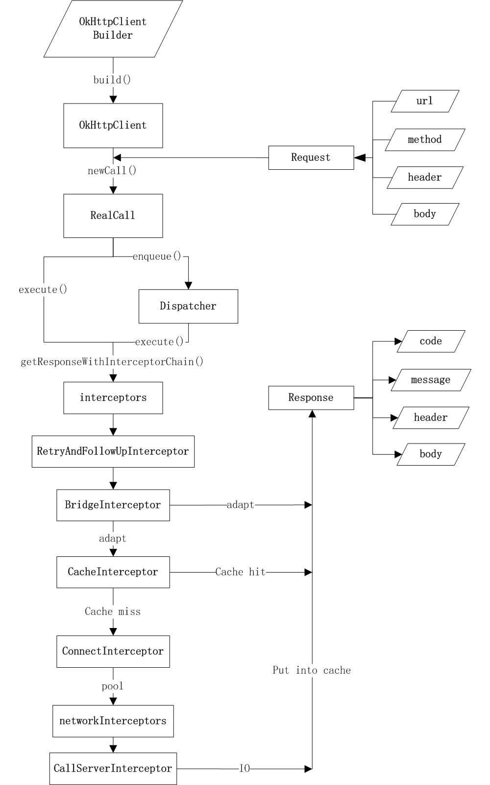

# 三方库分析

## OkHttp

### okhttp 调用流程

### 设计思想

okhttp毋庸置疑是一个非常优秀的网络框架，那么相较于其他网络框架有啥优点呢？

- 安全可靠
  - 其内置连接池，在一定时效内缓存连接对象，这使得访问更加快速，同时也对资源进行了合理利用。
  - 支持socket和隧道
  - 针对get请求做了缓存

- 易于扩展
  - 

#### 同步与异步实现区别

#### 拦截器实现原理

#### 链接池实现机制

#### 拦截器

#### 调度器

## Retrofit

## RxJava

## Glide

